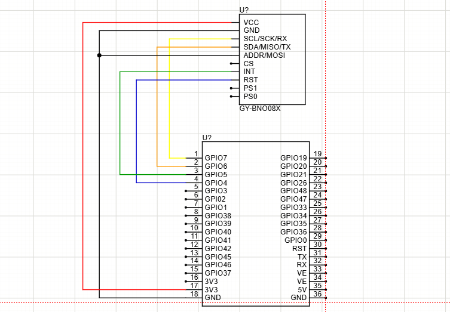

# Projeto BNO085 para ML com Edge Impulse

Este repositório contém o código-fonte de um projeto para o **ESP32-S3** projetado para ler dados de um sensor de IMU **BNO085** e exibi-los tanto em um display OLED quanto na saída serial. 

O principal objetivo deste projeto é **deixar o dispositivo configurado para enviar os dados de aceleração e giroscópio para a plataforma Edge Impulse**, utilizando a ferramenta [Edge Impulse Data Forwarder](https://docs.edgeimpulse.com/docs/tools/edge-impulse-cli/data-forwarder). Isso permite a aquisição de dados em tempo real para o treinamento de modelos de Machine Learning (ML).

## Características

- Leitura contínua dos dados inerciais utilizando o sensor BNO085.
- Alternância entre leitura de **Aceleração Linear** (sem gravidade) e **Aceleração Global** (com gravidade).
- O botão para alternar os modos está conectado ao **GPIO35** (configurado com *pull-up* interno, ativado em borda de descida/GND).
- Os dados são exibidos no display OLED I2C para visualização rápida da configuração e dados em tempo real.
- Saída formatada via Serial, pronta para ser capturada pelo Edge Impulse CLI.

## Como usar com o Edge Impulse

Como o ESP32 envia os dados continuamente pela porta serial em formato CSV (separado por vírgulas), você pode usar o `edge-impulse-data-forwarder` para enviar os dados para o seu projeto no Edge Impulse.

1. Instale o [Edge Impulse CLI](https://docs.edgeimpulse.com/docs/tools/edge-impulse-cli/cli-installation).
2. Conecte o ESP32-S3 via cabo USB.
3. Abra um terminal e execute o comando:
   ```bash
   edge-impulse-data-forwarder
   ```
4. Siga as instruções na tela, faça login e associe os eixos do sensor no seu projeto do Edge Impulse.
5. Inicie a aquisição de dados (Record new data) diretamente na plataforma do Edge Impulse.

## Conexões e Diagrama Elétrico

Abaixo estão detalhados os pinos utilizados no ESP32-S3 e como conectá-los aos módulos BNO085 e OLED.

### Pinos configurados

- **GPIO35:** Botão para alternar entre aceleração global (com gravidade) e aceleração linear (sem gravidade). O botão deve ligar este pino ao **GND** quando pressionado.
- (Verifique no arquivo `sdkconfig` ou configurações de `menuconfig` os pinos de I2C exatos para SDA e SCL, que foram configurados para o sensor BNO e para o Display OLED).

### Diagrama Elétrico



